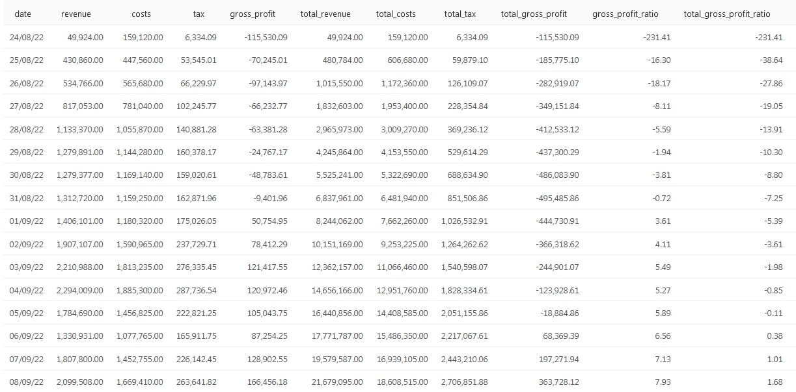

## Дано:

Есть база данных содержащая информацию по продажам интернет магазина. База данных содержит отдельные таблицы с информацией о наименовании и стоимости товаров, курьерах, покупателя, заказах.  

Структура данных:

* **user_actions** — действия пользователей с заказами
* **courier_actions** — действия курьеров с заказами
* **orders** — информация о заказах
* **users** — информация о пользователях
* **couriers** — информация о курьерах
* **products** — информация о товарах, которые доставляет сервис
 

## Задания:

Для каждого дня в таблицах orders и courier_actions рассчитайте следующие показатели:

    1. Выручку, полученную в этот день.
    2. Затраты, образовавшиеся в этот день.
    3. Сумму НДС с продажи товаров в этот день.
    4. Валовую прибыль в этот день (выручка за вычетом затрат и НДС).
    5. Суммарную выручку на текущий день.
    6. Суммарные затраты на текущий день.
    7. Суммарный НДС на текущий день.
    8. Суммарную валовую прибыль на текущий день.
    9. Долю валовой прибыли в выручке за этот день (долю п.4 в п.1).
    10. Долю суммарной валовой прибыли в суммарной выручке на текущий день (долю п.8 в п.5).

## Условия:

Колонки с показателями назовите соответственно revenue, costs, tax, gross_profit, total_revenue, total_costs, total_tax, total_gross_profit, gross_profit_ratio, total_gross_profit_ratio

Колонку с датами назовите date.

Долю валовой прибыли в выручке необходимо выразить в процентах, округлив значения до двух знаков после запятой.

Результат должен быть отсортирован по возрастанию даты.

Поля в результирующей таблице: date, revenue, costs, tax, gross_profit, total_revenue, total_costs, total_tax, total_gross_profit, gross_profit_ratio,total_gross_profit_ratio

Чтобы посчитать затраты, в этой задаче введём дополнительные условия.

В упрощённом виде затраты нашего сервиса будем считать как сумму постоянных и переменных издержек. К постоянным издержкам отнесём аренду складских помещений, а к переменным — стоимость сборки и доставки заказа. Таким образом, переменные затраты будут напрямую зависеть от числа заказов.

Из данных, которые нам предоставил финансовый отдел, известно, что в августе 2022 года постоянные затраты составляли 120 000 рублей в день. Однако уже в сентябре нашему сервису потребовались дополнительные помещения, и поэтому постоянные затраты возросли до 150 000 рублей в день.

Также известно, что в августе 2022 года сборка одного заказа обходилась нам в 140 рублей, при этом курьерам мы платили по 150 рублей за один доставленный заказ и ещё 400 рублей ежедневно в качестве бонуса, если курьер доставлял не менее 5 заказов в день. В сентябре продакт-менеджерам удалось снизить затраты на сборку заказа до 115 рублей, но при этом пришлось повысить бонусную выплату за доставку 5 и более заказов до 500 рублей, чтобы обеспечить более конкурентоспособные условия труда. При этом в сентябре выплата курьерам за один доставленный заказ осталась неизменной.

## Решение

Код запроса SQL с комментариями находится в файле **task1.sql**

## Финальная таблица:
 
